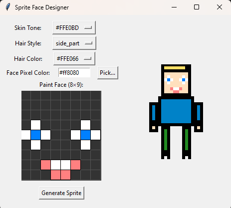

# PixelPersona

PixelPersona is a small Python/Tkinter application for creating 32x32 pixel-art characters. It features an interactive 8×9 pixel face editor and randomly generated outfits.

## Screenshot



## Features
- Interactive face editor with color picker and clear functionality
- Randomized body, arms, legs, hair and clothing styles
- Incremental saves under `output_sprites/custom_sprite_XXX.png`

## Dependencies
- Python 3.9+
- Pillow
- tkinter (usually included with Python on most systems)

## Installation


```bash
git clone https://github.com/your-username/spritegen.git
cd spritegen
python -m venv venv        # optional
source venv/bin/activate   # macOS/Linux
venv\Scripts\activate    # Windows
pip install pillow tk
```

## Usage

```bash
python main.py
```

1. Select a skin tone, hair style and hair color from the menus.
2. Pick a face pixel color using the color picker.
3. Left-click in the face grid to paint; right-click to erase individual pixels.
4. Click **Clear Face** to reset the grid.
5. Press **Generate Sprite** to save your design in the `output_sprites/` folder.

Each click on *Generate Sprite* increments the output file number (`custom_sprite_001.png`, `custom_sprite_002.png`, …).

## Animation

This repository currently generates static sprites only. Support for animated output
(e.g. spritesheets or GIFs) is not yet implemented. If animation features are added
in the future, this section will contain instructions on how to use them.