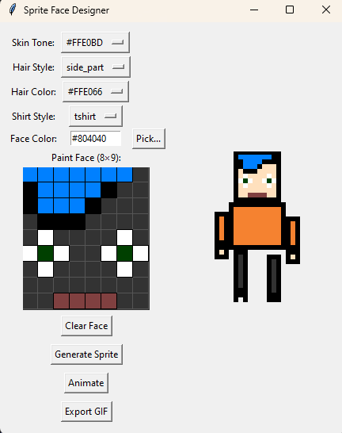

# Pixel Persona Designer

A small Python/Tkinter application for designing and exporting 32×32 pixel avatars (“personas”).
Choose body shapes, clothing styles (shirt & tie, lab coat, dress), preview an animated GIF, and batch-export your creations.

---

## 📸 Preview




---

## 🚀 Features

* **Live preview & animation** — see your sprite animate as you tweak colors and styles
* **Multiple styles** — shirt+tie, lab coat, dress, plus easy extension
* **Batch export** — dump your designs to `output_sprites/custom_XXX.png`

---

## ⚙️ Requirements

* Python 3.8+
* [Pillow](https://python-pillow.org/)

Install with:

```bash
pip install -r requirements.txt
```

---

## 🛠️ Installation & Running

1. **Clone or copy** this repo (root is the folder containing `main.py`).
2. Ensure you’re in the repo root, then install dependencies:

   ```bash
   pip install -r requirements.txt
   ```
3. **Launch** the GUI:

   ```bash
   python main.py
   ```
4. Tweak your persona and click **Export** to save PNGs under `output_sprites/`.

---

## 📂 Project Structure

```
.
├── anim_001.gif          # animated preview
├── requirements.txt
├── screenshot.png        # static UI screenshot
├── main.py               # entry-point: launches the designer
├── pixelpersona_designer/  
│   ├── drawing.py        # tie, coat, dress rendering logic
│   ├── sprite_builder.py # builds/manages the sprite canvas
│   ├── sprite_animator.py
│   └── …                 
├── output_sprites/       # where exported PNGs land
└── .gitignore            # ignores walker_rl/ & spriteGen/
```

---

## 🤝 Contributing

1. Fork the repo
2. Create a new branch
3. Make your tweaks (e.g. add new clothing styles)
4. Submit a pull request

---

## 📄 License

This project is MIT-licensed. See [LICENSE](LICENSE) for details.
